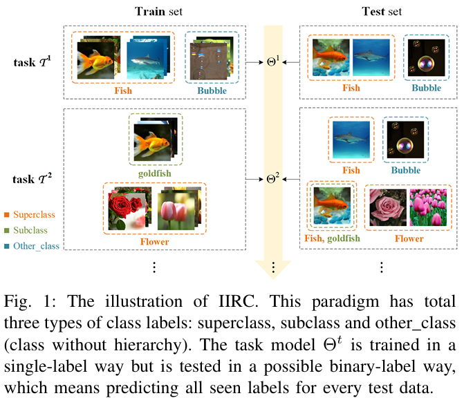

## Introduction
This is our implementation of our paper *Reciprocal Transport with Dynamic Hyperbolic Hierarchy for Incremental Implicitly-Refined Classification*.

**TL;DR**: A method based on dynamic hyperbolic hierarchy and knowledge reciprocal transport for incremental implicitly-refined classification.

**Abstract**:
—Incremental Implicitly-Refined Classification(IIRC), analog to human cognitive process, is an extended class-incremental learning (CIL) paradigm 
 which requires to not only accumulate knowledge incrementally but refine the understanding of entities through hierarchical associations of superclasses and subclasses.
 The main challenges lie in: (a) incrementally discovering the hierarchical relation of superclasses and subclasses, and (b) resisting the catastrophic forgetting of the hierarchical relation. 
 Existing methods utilize either static hierarchical relations, or traditional knowledge transfer schemes used in CIL, leading to unsatisfactory performance.
 We propose a framework called Reciprocal Transport with Dynamic Hyperbolic Hierarchy (RTDHH), which comprises the Dynamic Hyperbolic Hierarchy (DHH),
 Forward Transport (FT) and Backward Transport (BT) modules. By exploiting the hierarchy representation of hyperbolic geometry, the DHH module continuously
 updates the hierarchical relation in the hyperbolic space, serving as a cost to guide reciprocal transport.
 Afterwards, the FT module transfers knowledge from old to new classes, enabling new classes to inherit and build upon old knowledge;
 while the BT module transfers knowledge reversely, enhancing the old knowledge retention using new classes. 
 Both the FT and BT modules utilize a class knowledge capacity scheme to control transported knowledge quantities. 
 In this way, the three modules create a feedback loop, where refined hierarchy guides the transport, and the transport promotes knowledge interaction to refine the hierarchy.
 Experiments on IIRC-CIFAR and IIRC-ImageNet benchmarks demonstrate the superiority of RTDHH over state-of-the-art methods. 

## IIRC Setup


## Our method: RTDHH


## Dependencies
lmdb==1.4.1
matplotlib==3.3.4
ml_logger==0.10.36
mllogger==0.7
numpy==1.19.5
opencv_python==4.4.0.46
pandas==1.1.5
Pillow==11.2.1
POT==0.9.1
pytest==7.0.1
requests==2.26.0
scikit_learn==1.6.1
scipy==1.5.2
seaborn==0.11.2
setuptools==49.6.0.post20200925
tensorflow==2.19.0
torch==1.10.1+cu111
torchvision==0.11.2+cu111
tqdm==4.64.1

## Usage

##### 1. Install dependencies
First we recommend to create a conda virtual environment with all the required packages by using the following command.
```
conda create --name RTDHH
```
This command creates a conda environment named `RTDHH`. You can activate the conda environment with the following command:
```
conda activate RTDHH
```
Using pip and installing dependencies from the requirements.txt file.
```
pip install -r requirements.txt
```
If you see the following error, you may need to install a PyTorch package compatible with your infrastructure.
```
RuntimeError: No HIP GPUs are available or ImportError: libtinfo.so.5: cannot open shared object file: No such file or directory
```
For example if your infrastructure only supports CUDA == 11.1, you may need to install the PyTorch package using CUDA11.1.
```
pip install torch==1.10.1+cu111 torchvision==0.11.2+cu111 -f https://download.pytorch.org/whl/torch_stable.html
```

##### 2. Run code
- IIRC-CIFAR
    ```
    python main.py --config_path "../experiments/experiments_configurations/configurations_cifar.json" --config_group RTDHH_20 
    ```
- IIRC-ImageNet-Subset
    ```
    python main.py --config_path "../experiments/experiments_configurations/configurations_imagenet_subset.json" --config_group RTDHH_20 
    ```
- IIRC-ImageNet-Lite
    ```
    python main.py --config_path "../experiments/experiments_configurations/configurations_imagenet_lite.json" --config_group RTDHH_20 
    ```
- IIRC-ImageNet-Full
    ```
    python main.py --config_path "../experiments/experiments_configurations/configurations_imagenet_full.json" --config_group RTDHH_20 
    ```


